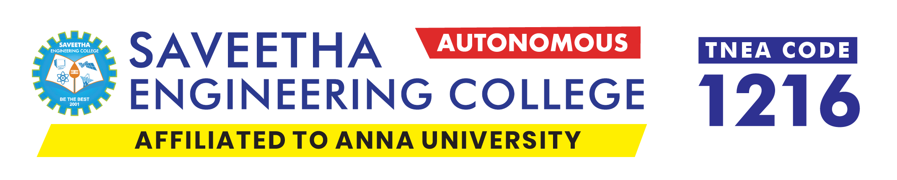

# Saveetha_Admission_clone

## Date: 09/09/2025

## Objective:

To design a landing page clone of Saveetha Engineering College’s Admission Enquiry form using HTML and CSS. This activity reinforces skills in layout design, form creation, user input handling, responsive structure, and visual styling based on a real-world example.

## Tasks:

#### 1. Analyze the Landing Page Layout:

Observe the split-screen layout with a promotional section on the left and a form on the right.

Note the use of background images, text styling, and branding elements.

#### 2. Create the HTML Structure:

Use semantic tags like `<section>, <header>, <form>, and <footer>` to organize content.

Structure the form with input fields such as name, email, phone, password, city, state, course, specialization, captcha, and checkbox.

#### 3. Add Form Functionality:

Include appropriate input types (text, email, tel, password, select, etc.) with placeholders and labels.

Use the <button> element for the "APPLY NOW" action.

#### 4. Apply CSS Styling:

Implement a split layout using flexbox or grid.

Style the form elements with padding, shadows, background colors, and rounded borders.

Include hover effects and button transitions to match the original look.

#### 5. Incorporate Images and Branding:

Add the institution logo and use matching fonts and colors.

Place a background image or blurred overlay behind the form content if needed.

#### 6. Ensure Responsiveness:

Make sure the page adapts to different screen sizes using media queries.

Maintain readability and layout integrity on both desktop and mobile.

## HTML Code:

```html
<!DOCTYPE html>
<html lang="en">
  <head>
    <meta charset="UTF-8" />
    <meta name="viewport" content="width=device-width, initial-scale=1.0" />
    <link rel="stylesheet" href="styles.css" />
    <title>Saveetha Engineering College</title>
  </head>
  <body>
    <div class="bg-img">
    <div class="container">
      <div class="left">
        <div class="image">
          
        </div>
        <div class="headings">
          <h1>INDUSTRY 5.0</h1>
          <h3>Ready Curriculum Imparting</h3>
          <h3><strong>21st Century Skills</strong></h3>
        </div>
        <div class="apply">
          <a
            href="https://admissions.saveetha.ac.in/?_gl=1*n3xaga*_ga*MTEzODgzMjA0Ny4xNzUxODYxNTIy*_ga_LSPFXD90MN*czE3NTIwMzI2MjkkbzIkZzEkdDE3NTIwMzMwOTYkajMyJGwwJGgw*_gcl_au*MTY3MDc1NTI1Ni4xNzUxODYxNTIy#linksec"
            >Apply Now</a
          >
        </div>
      </div>
      <div class="right">
        <div>
          <p>Admissions Open 2025</p>
        </div>
        <div class="form">
          <form action="">
            <div class="nep">
              <input
                type="text"
                placeholder="Enter Name *"
                required
              />
            </div>
            <div class="nep">
              <input
                type="email"
                placeholder="Enter Email Address *"
                required
              />
              </div>
              <div class="phone-number">
                <select name="phone" id="" required>
                  <option value="in">+91</option>
                  <option value="fr">+33</option>
                </select>
                <input
                  type="text"
                  placeholder="Enter Mobile Number *"
                  required
                />
              </div>
              <div class="nep">
              <input
                type="password"
                placeholder="Any Password of Your Choice *"
                required
              />
              </div>
              <div class="sc">
                <input type="text" placeholder="State *" required />
                <input type="text" placeholder="City *" required />
              </div>
              <div class="sc">
              <input type="text" placeholder="Course *" required />
              <input type="text" placeholder="Specialisation *" required />
            </div>
              <div class="captcha">
                <p>813de</p>
                <input type="text" placeholder="Enter Captcha" />
              </div>
              <div class="check">
              <input type="checkbox" name="agree" id="agree"/>
              <label for="agree" id="agree"
                >I authorise Saveetha Engineering College & its representatives
                to contact me with updates and notifications via
                Email/SMS/What'sApp/Call. This will override DND/NDNC*</label
              ></div>
              <button type="submit">Apply Now</button>
              <p class="verification">Already have an Account? <a href="#">Login</a> <br>Resend Verification Email</p>
            </div>
          </form>
        </div>
      </div>
    </div>
  </div>
  </body>
</html>


```

## CSS Code:

```css
.bg-img {
  background-image: url(image.png);
  background-position: left;
  background-size: 80%;
  height: 98vh;
  margin: 0;
}
.container {
  display: flex;
  flex-direction: row;
}
.left {
  display: flex;
  flex-direction: column;
  margin-left: 5em;
}
.right {
  width: 100%;
  max-width: 400px;
  padding: 2em;
  border-radius: 10px;
  box-shadow: 0 0 10px rgba(0, 0, 0, 0.3);
  background-color: rgba(0, 0, 0, 0.6);
  overflow-y: auto;
  color: #fff;
  margin: 3em auto;
  text-align: center;
}
.same {
  width: 100%;
  max-width: 200px;
}
* {
  box-sizing: border-box;
}
.headings h1 {
  font-family: "Times New Roman", Times, serif;
  color: rgb(255, 255, 0);
}
.headings {
  margin: 2em;
  color: white;
}
.apply {
  border: 1px solid;
  background-color: yellow;
  border-radius: 10px;
  width: 50%;
  max-width: fit-content;
  padding: 1em;
  margin-left: 2em;
  border: 1px white solid;
}
.apply a {
  color: black;
  text-decoration: none;
}
.nep {
  margin: 0.5em;
}
.nep input {
  padding: 1em;
  border-radius: 0.2em;
  border: #fff;
  width: 100%;
}
.phone-number {
  display: flex;
  flex-direction: row;
  justify-content: space-between;
  margin: 0.5em;
}
.phone-number select {
  width: 18%;
  border: white;
  padding: 0.25em;
  border-radius: 0.2em;
}
.phone-number input {
  width: 80%;
  padding: 1em;
  border-radius: 0.2em;
  border: #fff;
  /* width: 100%; */
}
.sc {
  margin: 0.25em;

  display: flex;
  flex-direction: row;
  justify-content: space-around;
}
.sc input {
  width: 50%;
  padding: 1em;
  border-radius: 0.2em;
  border: #fff;
  margin: 0.25em;
}
.captcha {
  display: flex;
  margin: 0.25em;
  justify-content: space-around;
}
.captcha input {
  width: 75%;
  padding: 1em;
  border-radius: 0.2em;
  border: #fff;
  margin: 0.25em;
}
.captcha p {
  border: 1px white solid;
  background-color: white;
  color: black;
}
.check label {
  font-size: small;
  margin: 1em;
  width: 75%;
  text-align: justify;
}
button {
  padding: 1em;
  margin: 0.5em;
  width: 100%;
  border-radius: 0.2em;
  border: #fff;
}
.verification {
  font-size: small;
  text-align: center;
}
.verification a {
  color: white;
  text-decoration: none;
}
.verification a:hover {
  text-decoration: underline;
}
```

## Output:


## Result:

A landing page clone of Saveetha Engineering College’s Admission Enquiry form using HTML and CSS is designed successfully.
